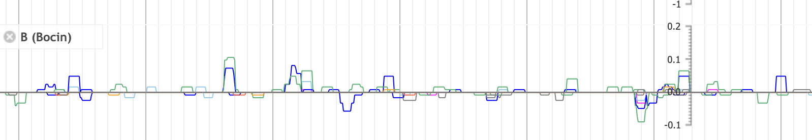
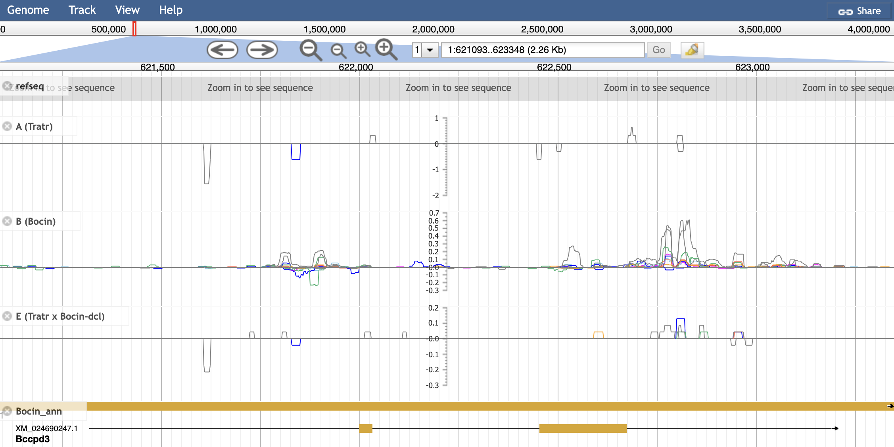

# sRNA-jbrowse
 A set of processing scripts for setting up jbrowse with ShortStack sRNA-data


### Motivation

Jbrowse (1) is an extremely powerful and modifiable genome browser. However, it can also be quite opaque how to set it up - especially with unique data (like sRNA seq clusters and alignment).

This repo is meant to be a set of directions to process sRNA-seq alignments, annotations, and genomic annotations to produce a high-quality jbrowse environment.

The aim of this pipeline is to emulate (nearly exactly) the format and style of data presented in [lunardon et al 2020](http://www.genome.org/cgi/doi/10.1101/gr.256750.119), found on the website: https://plantsmallrnagenes.science.psu.edu/.


## Prerequisites
The following software must be runable from command line.


```python3```

```gt``` (genometools, http://genometools.org/) - this can also be installed easily through package managers (brew install genometools for mac)

```bgzip``` and ```tabix``` - both available through the htslib package http://www.htslib.org/download/

```ShortStack``` - available from https://github.com/MikeAxtell/ShortStack, with additional required packages.

## What files as inputs?

* Genome sequence file (.fa)
* Genome annotation file (.gff3)
* ShortStack sRNA annotation (.gff3)
* Coverage files (.bigwig) - produced from ShortStack alignment


## General pipeline


## Configuring jbrowse

Plotting multiple coverage plots is not natively supported by jbrowse. This functionality is available through a plugin [multibigwig]('https://github.com/elsiklab/multibigwig'), but this pug in is not available for jbrowse2 as of Oct 2022. 

This leaves us to use jbrowse1, a tool which is still powerful and relevant. However, it's installation and use can be challenging. Following their [installation page](https://jbrowse.org/docs/installation.html) is quite useful, though it is important to install the complete version (which allows plugins).

Once you have downloaded and booted a sample jbrowse window in your browser, we can continue to configure and prepare our files.

Installation of multibigwig is simple, and found through their link.

**Directories** for data should be organized in the 'data' folder (you can replace what is there). Here we can put in our data in an organized format.

Track configuration is shown below - this is challenging and quirky.


## Reformatting ShortStack gff

The general output of all annotations from a ShortStack run is a gff3 file. Several modifications need to be performed to make it work for jbrowse. We first add a header giving ```sequence-region``` identifiers. We also remove gff description keys that start with a capital letter.

```python cleanup_gff.py -g ShortStack_All.gff3 ```

Subsequent steps sort, block-zip, and index this gff.

```
gt gff3 -retainids -sortlines -tidy ShortStack_All.clean.gff3 > ShortStack_All.clean.sorted.gff3
bgzip ShortStack_All.clean.sorted.gff3 
tabix -f -p gff ShortStack_All.clean.sorted.gff3.gz 
```

All of these steps should hopefully function using the single python script:

```python prepare_gff.py ShortStack_All.gff3```


## Producing BigWigs of coverage data

We want to show small RNA coverage data along the genome browser. For this we will need to transform our alignment into coverage files (wiggle/wig format). 



These give a genomic coordinate and coverage depth, for each chromosome and position. Span of a region matching a depth is given in the track values "variableStep". In the following example. you can see the first and final parts of the chromosome are long spans with depth of 0 (there are no sRNA alignments for the start and end of these chromosomes).

```
variableStep chrom=1 span=77603
1 0.0
variableStep chrom=1 span=19
77604 0.306
...
...
...
variableStep chrom=1 span=19
4091705 0.306
variableStep chrom=1 span=17649
4091724 0.0
```

Wig files are transformed into bigwigs, which indexes them and allows for rapid access at any given genomic position queried in the browser.


***This process*** is managed by a complicated script called ```bigwigify.py```.

```
usage: bigwigify.py [-h] -b [BAM_FILE] [-r READGROUPS [READGROUPS ...]]
                    [-c CHROMOSOMES [CHROMOSOMES ...]] [-s SIZES [SIZES ...]]
                    -o [OUTPUT_DIRECTORY] [--delete_wigs] [--quiet]

options:
  -h, --help            show this help message and exit
  -b [BAM_FILE], --bam_file [BAM_FILE]
                        bamfile of aligned small RNAs (tested with shortstack)
  -r READGROUPS [READGROUPS ...], --readgroups READGROUPS [READGROUPS ...]
                        list of read_groups to be read. Specify `all` to
                        report all. Check RGs with `samtools view -H
                        bamfile.bam`
  -c CHROMOSOMES [CHROMOSOMES ...], --chromosomes CHROMOSOMES [CHROMOSOMES ...]
                        list of chromosomes to be read. Defaults to report
                        all. Check chromosomes with `samtools view -H
                        bamfile.bam`.
  -s SIZES [SIZES ...], --sizes SIZES [SIZES ...]
                        list of sRNA sizes to be analyzed separately
  -o [OUTPUT_DIRECTORY], --output_directory [OUTPUT_DIRECTORY]
                        folder to save resulting wigs/bigwigs
  --delete_wigs         include to delete wig files from the result
  --quiet               prints output in a much more discrete format
```

This script is developed specifically for ShortStack alignment bamfiles. Here, we can input a ```merged_alignment.bam```, and split bigwig outputs by readgroup, chromosome, and sRNA-size. These are important, as they will need to be input as separate tracks in jbrowse. We also separate by strand (+ as positive values, - as negative) as this is essential with sRNAs.

Read groups are indicitive of the input libraries for the ShortStack run, and may want to be joined or separated depending on your run. ***In a basic run***, one might want to separate replicated readgroups, also splitting up default size ranges for plant sRNAs (20, 21, 22, 23, 24). Larger and smaller sRNAs will be grouped.

Here's an example:

```
samtools view -H 01out-BC.bocin.bam

# output:
...
...
@RG ID:B-A1.t
@RG ID:B-A2.t
@RG ID:B-A3.t
@RG ID:C-R10.t
@RG ID:C-R5.t
@RG ID:C-R8.t


bigwigify.py -b 01out-BC.bocin.bam \
-r B-A1.t B-A2.t B-A2.t # these are replicated read groups
```

I could also specify size ranges using -s. ```-s 19 23``` for example to indicate sizes <19, 20, 21, 22, 23, >23.

Importantly, use ```-o``` to give the directory. These will be important to keep clear between readgroups as jbrowse will need to locate your bigwigs.

This script ***makes one more file*** a pre-filled configuration script. This can be copy+pasted into the track conf to add this multibigwig.

***Note:*** This is not an easy task... It will take time and computing power, as any process will that processes a bam file.


## Jbrowse track configuration

This is one of the more challenging aspects of this process. The format for tracks is not totally clear.

I have attached the config files for a sample of my own data (not provided, too large for github). These can provide an example of the structure.

```trackList.json``` is simply a json file referencing the plugin we are using:
```
{
   "plugins": ["MultiBigWig"]
}
```

```tracks.conf``` communicates all of the plotting details. Note all of the file locations are specified by the url dimensions.

***The indexed genome file input*** (and another plugin??)
```
[GENERAL]

refSeqs=Tratr_Bocin.fa.fai

[ plugins.StrandedPlotPlugin ]
location = plugins/StrandedPlotPlugin

[tracks.refseq]
urlTemplate=Tratr_Bocin.fa
storeClass=JBrowse/Store/SeqFeature/IndexedFasta
type=Sequence
showTranslation=false
showColor=false
```

***The gene annotations for the aligned genome above.*** Note, these have gone through the same GFF3 pipeline.
```
[tracks.Bocin_ann]
urlTemplate=Bocin.genes.sorted.gff3.gz
storeClass=JBrowse/Store/SeqFeature/GFF3Tabix
type=CanvasFeatures
```

***Our formatted annotation of sRNAs from ShortStack***
```
[tracks.ShortStack_ann]
urlTemplate=ShortStack_All.clean.sorted.gff3.gz
storeClass=JBrowse/Store/SeqFeature/GFF3Tabix
type=CanvasFeatures
```

***An example of a multibigwig track.*** Key gives the name for a track where multiple bigwigs will be plotted. These are added with urlTemplates, where we give the file location, name, and color for each line. These colors are identical to the reference paper.
```
[tracks.A ]
key=A (Tratr)
type=MultiBigWig/View/Track/MultiWiggle/MultiXYPlot
storeClass=MultiBigWig/Store/SeqFeature/MultiBigWig
maxExportSpan=500000
autoscale=local
logScaleOption=true
style+=json:{
    "pos_color": "blue",
    "neg_color": "red",
    "origin_color": "#888",
    "variance_band_color": "rgba(0,0,0,0.3)",
    "bg_color": "grey"
  }
showTooltips=true
urlTemplates+=json:{"url":"bigwig_A/19+.bigwig", "name": "19+", "color": "magenta"}
urlTemplates+=json:{"url":"bigwig_A/19-.bigwig", "name": "19-", "color": "magenta"}
urlTemplates+=json:{"url":"bigwig_A/20+.bigwig", "name": "20+", "color": "skyblue"}
urlTemplates+=json:{"url":"bigwig_A/20-.bigwig", "name": "20-", "color": "skyblue"}
urlTemplates+=json:{"url":"bigwig_A/21+.bigwig", "name": "21+", "color": "blue"}
urlTemplates+=json:{"url":"bigwig_A/21-.bigwig", "name": "21-", "color": "blue"}
urlTemplates+=json:{"url":"bigwig_A/22+.bigwig", "name": "22+", "color": "mediumseagreen"}
urlTemplates+=json:{"url":"bigwig_A/22-.bigwig", "name": "22-", "color": "mediumseagreen"} 
urlTemplates+=json:{"url":"bigwig_A/23+.bigwig", "name": "23+", "color": "orange"}
urlTemplates+=json:{"url":"bigwig_A/23-.bigwig", "name": "23-", "color": "orange"} 
urlTemplates+=json:{"url":"bigwig_A/24+.bigwig", "name": "24+", "color": "tomato"}
urlTemplates+=json:{"url":"bigwig_A/24-.bigwig", "name": "24-", "color": "tomato"} 
urlTemplates+=json:{"url":"bigwig_A/short+.bigwig", "name": "short+", "color": "grey"}
urlTemplates+=json:{"url":"bigwig_A/short-.bigwig", "name": "short-", "color": "grey"} 
urlTemplates+=json:{"url":"bigwig_A/long+.bigwig", "name": "long+", "color": "grey"}
urlTemplates+=json:{"url":"bigwig_A/long-.bigwig", "name": "long-", "color": "grey"} 
```

My included config files give some more examples of these, though not all are named identically.


## Was it worth it?

Your jbrowse server can be started with the following command run in the jbrowse directory:
```
npm run start
```

Behold! the fruits of your labor




